```{r setup, include=FALSE}
knitr::opts_chunk$set(echo = TRUE)
```

## Formål

Dette dokument har til formål at gennemgå det frigivne "overvågningsdata" publiceret af Statens Serums Institut mhp. at vurdere, hvilke af deres figurer der kan repliceres.

Først gennemgås det frigivne data, tilgængeligt via [overvågningssiden](https://www.ssi.dk/sygdomme-beredskab-og-forskning/sygdomsovervaagning/c/covid19-overvaagning) og [arkivet](https://www.ssi.dk/sygdomme-beredskab-og-forskning/sygdomsovervaagning/c/covid19-overvaagning/arkiv-med-overvaagningsdata-for-covid19).

Herefter gennemgås alle figurer på [overvågningssiden](https://www.ssi.dk/sygdomme-beredskab-og-forskning/sygdomsovervaagning/c/covid19-overvaagning) en for en, med en vurdering af hvorledes figuren kan gengives fra det tilgængelige data. I fald figuren ikke kan repliceres, angives hvilke data der mangler.

## Datakilder

Data fra SSI er gjort tilgængeligt via [overvågningssiden](https://www.ssi.dk/sygdomme-beredskab-og-forskning/sygdomsovervaagning/c/covid19-overvaagning) og [arkivet](https://www.ssi.dk/sygdomme-beredskab-og-forskning/sygdomsovervaagning/c/covid19-overvaagning/arkiv-med-overvaagningsdata-for-covid19).

### Overvågningssiden

Overvågnings siden publicerer jf. SSI "Alle aktuelle data om overvågning af COVID-19".


### Overvågningsarkiv

Arkivet indeholder jf. SSI "... tidligere publicerede data fra Statens Serum Institut (SSI) ifm. overvågning af COVID-19.". På arkivet findes

  1. Filer med overvågningsdata (zip-csv), herunder kommunedata fra den 6. maj og frem
  2. Epidemiologisk overvågningsrapporter fra den 12. marts til 19. maj (PDF med tabeller). SSI ophørte med at udgive epidemiologiske rapporter den 20. maj med reference til at alle data nu findes på siden "Overvågnings siden".
  3. Kommunedata den 27. marts-5. maj (PDF-tabeller).


## Figurer

Her gennemgås samtlige figurer i overvågningsrapporten pr. d. 18/6-2020.

### Figur 1.1 Antal testede personer og bekræftede tilfælde af COVID-19, samt andelen der er testet positiv som ikke tidligere er konstateret smittet (orange kurve), per dag

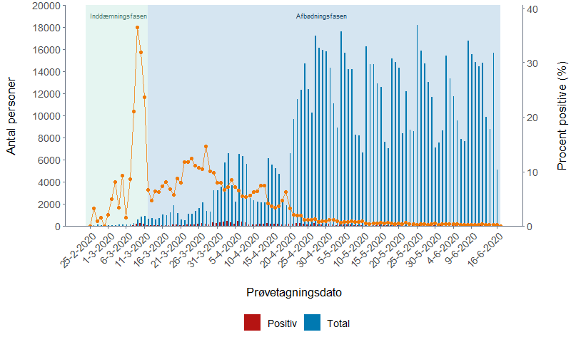

Denne figur kan genvies ud fra CSV-filen "Test_pos_over_time.csv" der findes i det publicerede zip-arkiv.

*Kan repliceres:* Ja

### Figur 1.2 Antal bekræftede tilfælde af COVID-19, per prøvetagningsdato

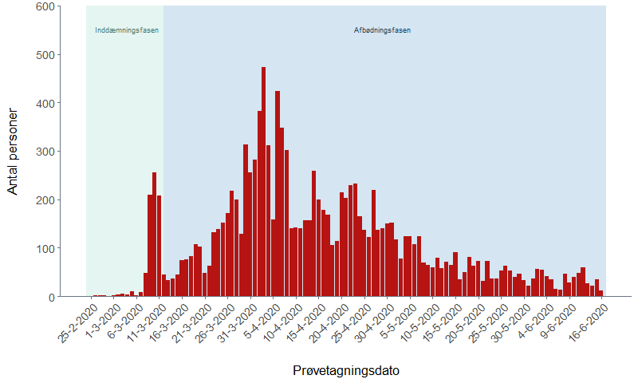

Se Figur 1.1.

*Kan repliceres:* Ja

### Figur 10.1 COVID-19 Antal tests fordelt på aldersgrupper og prøvetagningsuge

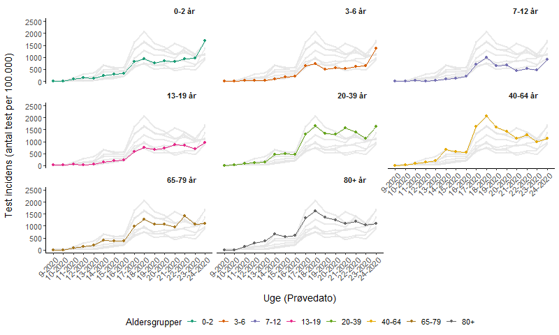

Antal tests fordelt på aldersgrupper er tilgængeligt i en aktuel (akkumuleret) tabel for dags dato, Tabel 10.1, på overvågningssiden. Tilsvarende tabel er tilgængelig i de publicerede zip-csv-akriver ("Cases_by_age.csv") der som Tabel 10.1 angiver akkumuleret test og positive fordelt på aldersgruppe. Akkumuleret data er kun tilgængeligt på hverdage.

Tidligere blev der publiceret daglige (på hverdage) overvågningsrapporter, hvor Tabel 10.1 fra overvågningssiden fremgik som Tabel 5 i PDF, tilgængeligt fra d. 24/3-2020 tom. 19/5-2020, hvorefter overvågningsrapporterne stopper. 

Da alle udgivne data er dagligt akkumuleret og kun publiceret på hverdage, kan en tilsvarende tabel på ugentlig basis ikke korrekt repliceres.

*Kan repliceres:* **Nej**

### Figur 10.2 COVID-19-incidens fordelt på aldersgrupper og prøvetagningsuge

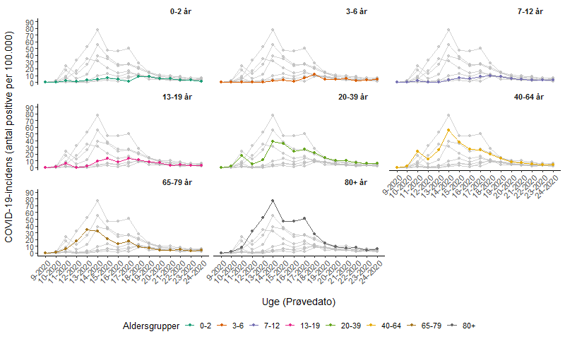

Se Figur 10.1.

*Kan repliceres:* **Nej**

### Figur 10.3 Antal bekræftede tilfælde fordelt på køn og alder

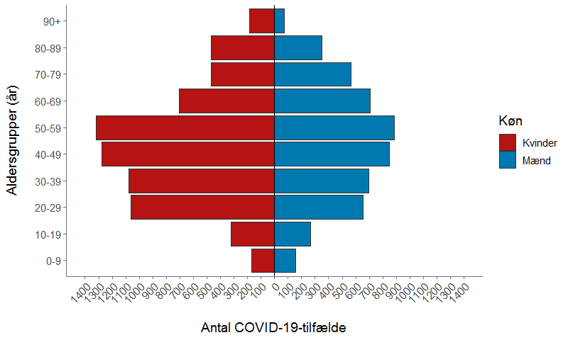

Figur 10.3 kan gengives fra data i de publicerede zip-csv-akriver ("Cases_by_sex.csv"), der også er opdelt efter aldersgruppe.

*Kan repliceres:* Ja


### Figur 2.1 Antal nyindlæggelser for patienter med bekræftet COVID-19, per indlæggelsesdato

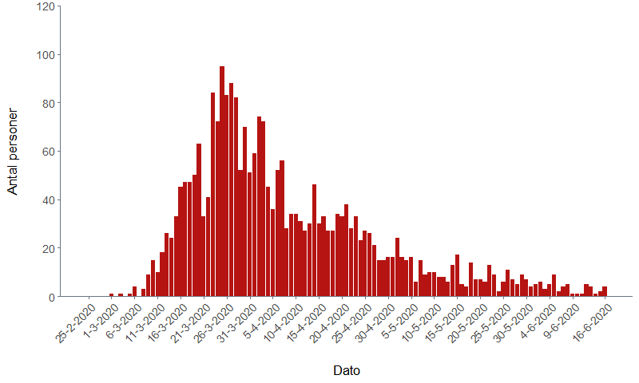

Figur 2.1 kan gengives ud fra data i de publicerede zip-csv-akriver ("Newly_admitted_over_time.csv"), der indeholder data for alle datoer siden 1/3-2020.

*Kan repliceres:* Ja

### Figur 3.1 Antal COVID-19-relaterede dødsfald, per dødsdato

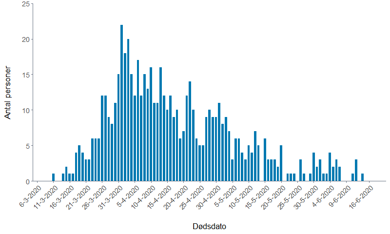

Figur 3.1 kan gengives ud fra data i de publicerede zip-csv-akriver ("Deaths_over_time.csv"), der indeholder data for alle datoer siden 11/3-2020.

*Kan repliceres:* Ja


### Figur 3.2. Kumuleret antal COVID-19-relaterede dødsfald, per dødsdato

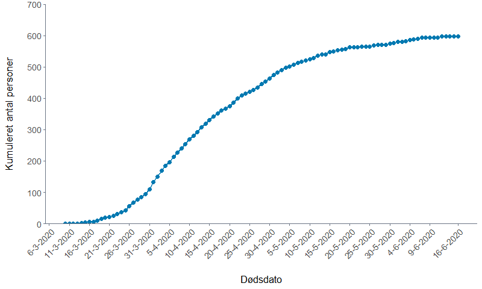

Se figur 3.1. Figur 3.2 kan dannes fra samme kilde.

*Kan repliceres:* Ja

### Figur 6.1. Antal bekræftede tilfælde af COVID-19 i alt per 100.000 indbyggere (kumulativ incidens) per kommune, med zoom på københavnsområdet øverst til højre

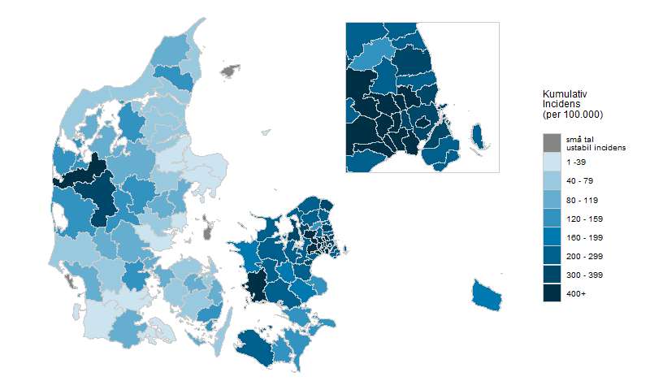

Figur 3.1 kan gengives ud fra data i de publicerede zip-csv-akriver ("Municipality_test_pos.csv").

*Kan repliceres:* Ja

### Figur 6.2. Antal nye bekræftede tilfælde af COVID-19 per 100.000 indbyggere, de seneste 7 dage, per kommune, med zoom på københavnsområdet øverst til højre

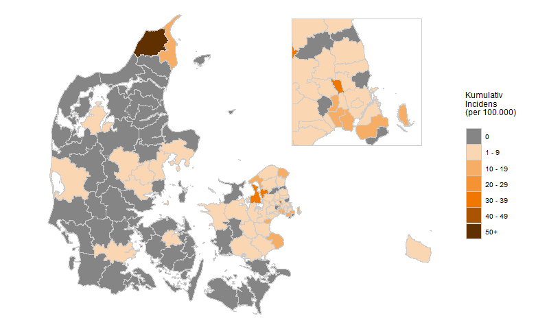

Kummulativ incidens fordelt på kommuner er tilgængelig i de publicerede zip-csv-akriver ("Cases_by_age.csv") der angiver akkumuleret test og positive fordelt på kommuner. Akkumuleret data er kun tilgængeligt på hverdage.

Da alle udgivne data er dagligt akkumuleret og kun publiceret på hverdage, kan en tilsvarende tabel på 7-dages basis ikke korrekt repliceres.

*Kan repliceres:* **Nej**

### Figur 7.1 Plejehjemsbeboere med bekræftet COVID-19 fordelt på prøvetagningsdato

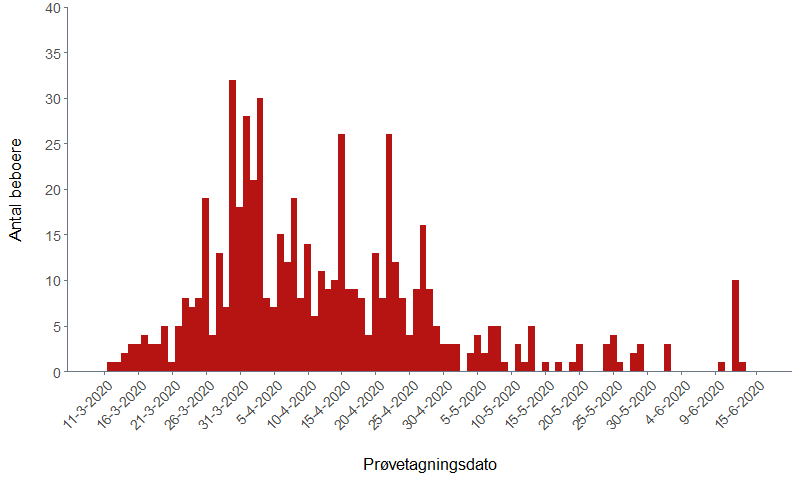

Tabel 7.1 på overvågningssiden angiver bekræftede tilfælde blandt plejehjemsbeboere fordelt per uge. Der er ikke noget data tilgængeligt på daglig basis i zip-csv akriver.

*Kan repliceres:* **Nej**

